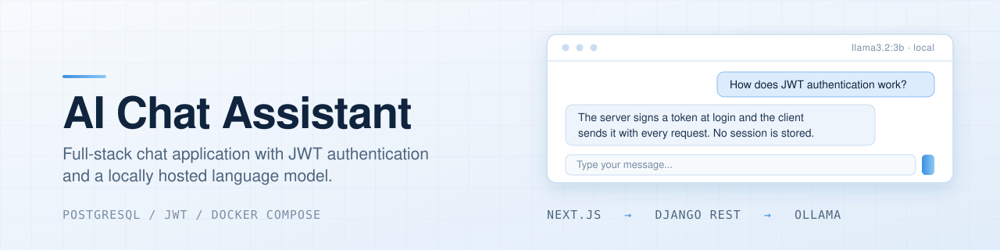
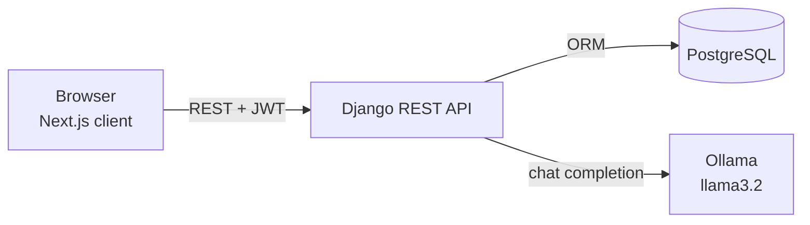

<p align="center">
  
</p>

A full-stack chat application in which authenticated users hold conversations with a language model that runs entirely on their own machine. The system is composed of a Next.js client, a Django REST API, a PostgreSQL database and an Ollama inference server, and the whole stack starts with a single `docker compose up`.

No external AI service or API key is required: inference is served locally by Ollama.

## Features

- **Local LLM inference.** Conversations are answered by a model served through Ollama (`llama3.2:3b` by default, configurable).
- **Token-based authentication.** Registration, login, profile management and password changes, secured with JWT access and refresh tokens. Refresh tokens are rotated and blacklisted on logout.
- **Persistent conversations.** Every chat and message is stored per user, and the complete history is sent to the model on each turn.
- **Monthly usage quota.** Each user has a message allowance that is enforced on the server and renewed automatically after the reset date.
- **Search.** The dashboard filters conversations by title or by message content.
- **Light and dark themes.** The preference is persisted in the browser.
- **Interactive API documentation.** An OpenAPI schema and Swagger UI are generated from the code.
- **One-command deployment.** Docker Compose provisions the database, the model server, the API and the client, and downloads the configured models on first start.

## Architecture



A message sent from the client follows this path:

1. The client calls `POST /api/chats/{id}/` with the user's JWT.
2. The API validates the message against the user's monthly quota.
3. Inside a database transaction, the API stores the user message, increments the usage counter, sends the full conversation history to Ollama and stores the assistant reply.
4. The reply is returned to the client, which reloads the conversation.

## Technology stack

| Layer | Technologies |
|---|---|
| Frontend | Next.js 16 (App Router), React 19, CSS variables for theming |
| Backend | Django 6, Django REST Framework, Simple JWT, drf-spectacular, django-cors-headers |
| Database | PostgreSQL 16 (SQLite for local development) |
| AI | Ollama, `llama3.2:3b` by default |
| Infrastructure | Docker, Docker Compose, multi-stage builds, GitHub Actions |

## Getting started

### Prerequisites

- Docker with Docker Compose v2
- Approximately 4 GB of free disk space for the model, and 8 GB of RAM recommended

### Run the stack

```bash
git clone https://github.com/andresgilvicente/fullstack-ai-assistant.git
cd fullstack-ai-assistant

# Optional: customise the configuration. Every variable has a development default.
cp .env.example .env

docker compose up --build
```

On the first start, the `ollama-init` service downloads the configured model, which can take several minutes. Follow its progress with:

```bash
docker compose logs -f ollama-init
```

### Access the services

| Service | URL |
|---|---|
| Web application | `http://localhost:3000` |
| API documentation (Swagger UI) | `http://localhost:8000/api/docs/` |
| Django admin | `http://localhost:8000/admin/` |
| Ollama | `http://localhost:11434` |

Create an account from the registration page to start chatting. To access the Django admin, create a superuser:

```bash
docker compose exec backend python restApi/manage.py createsuperuser
```

### Stop the stack

```bash
docker compose down        # stop the containers
docker compose down -v     # also delete the database and downloaded models
```

## Configuration

Docker Compose reads a `.env` file at the repository root. All variables are optional and fall back to development defaults. A template is provided in `.env.example`.

| Variable | Default | Description |
|---|---|---|
| `OLLAMA_MODELS` | `llama3.2:3b` | Comma-separated list of models downloaded on start-up. |
| `OLLAMA_MODEL` | `llama3.2:3b` | Model used to answer chat requests. |
| `POSTGRES_DB` | `assistant_db` | Database name. |
| `POSTGRES_USER` | `assistant` | Database user. |
| `POSTGRES_PASSWORD` | `assistant_password` | Database password. |
| `DJANGO_SECRET_KEY` | development key | Django secret key. **Must be set in production.** |
| `DEBUG` | `True` | Django debug mode. **Set to `False` in production.** |
| `NEXT_PUBLIC_API_URL` | `http://localhost:8000` | Backend URL as seen from the browser. Inlined at build time. |

Smaller models trade answer quality for speed. For example, `llama3.2:1b` runs comfortably on modest hardware, while `mistral:7b` gives stronger answers at a higher memory cost.

The defaults are intended for local use. Before exposing the application, set a strong `DJANGO_SECRET_KEY`, set `DEBUG=False`, change the database credentials, restrict `ALLOWED_HOSTS` and `CORS_ALLOWED_ORIGINS`, and serve the application over HTTPS.

## API reference

The complete, interactive reference is served at `/api/docs/`, and the machine-readable schema at `/api/schema/`. Endpoints other than registration, login, token refresh and the healthcheck require an `Authorization: Bearer <access token>` header.

| Method | Endpoint | Description |
|---|---|---|
| `POST` | `/api/users/register/` | Create an account and receive a token pair. |
| `POST` | `/api/auth/login/` | Obtain an access and refresh token pair. |
| `POST` | `/api/auth/refresh/` | Exchange a refresh token for a new access token. |
| `POST` | `/api/users/logout/` | Blacklist a refresh token. |
| `GET` `PUT` | `/api/users/profile/` | Read or update the current user. |
| `PUT` | `/api/users/profile/password/` | Change the password. |
| `GET` | `/api/usage/` | Messages used, limit and reset date. |
| `GET` `POST` | `/api/chats/` | List the user's chats or create a new one. |
| `GET` `DELETE` | `/api/chats/{id}/` | Retrieve a chat with its messages, or delete it. |
| `POST` | `/api/chats/{id}/` | Send a message and receive the assistant reply. |
| `GET` | `/api/healthcheck/` | Service status. |

Example:

```bash
# Log in
curl -X POST http://localhost:8000/api/auth/login/ \
  -H "Content-Type: application/json" \
  -d '{"username": "alice", "password": "Str0ngPassword"}'

# Send a message to chat 1
curl -X POST http://localhost:8000/api/chats/1/ \
  -H "Authorization: Bearer <access token>" \
  -H "Content-Type: application/json" \
  -d '{"content": "Explain what a REST API is in two sentences."}'
```

## Local development

Running the services without Docker is useful for faster iteration. An Ollama instance must be reachable at `http://localhost:11434` (set `OLLAMA_HOST` otherwise).

### Backend

Requires Python 3.14 and uv.

```bash
cd backend
cp .env.example .env
uv sync
source .venv/bin/activate        # Windows: .venv\Scripts\activate

cd restApi
python manage.py migrate
python manage.py runserver
```

By default the backend uses SQLite. Set `USE_POSTGRES=true` and the `POSTGRES_*` variables to use PostgreSQL.

### Frontend

Requires Node.js 20 or later.

```bash
cd frontend
npm install
npm run dev
```

The client expects the API at `http://localhost:8000`. Override it with `NEXT_PUBLIC_API_URL`.

## Testing

```bash
# Backend: unit and API tests (the LLM is mocked, so Ollama is not required)
cd backend/restApi
python manage.py test

# Frontend: lint and production build
cd frontend
npm run lint
npm run build
```

Both suites run in continuous integration on every push and pull request; see `.github/workflows/ci.yml`.

## Project structure

```
|
├── backend/
│   ├── restApi/
│   │   ├── restApi/        Project settings and URL routing
│   │   ├── users/          Registration, profile, password change, logout
│   │   ├── chats/          Chats, messages and the message-sending endpoint
│   │   ├── usage/          Monthly message quota
│   │   ├── ai/             Ollama client
│   │   └── healthcheck/    Liveness endpoint
│   ├── Dockerfile
│   └── pyproject.toml
├── frontend/
│   ├── src/
│   │   ├── app/            Routes: login, register, dashboard, chat, profile
│   │   ├── components/     Header, footer and shared layout
│   │   ├── context/        Authentication and theme providers
│   │   └── services/       API client
│   └── Dockerfile
├── docs/
│   ├── assets/             Repository assets
│   └── sprint-reports/     Project reports, one per sprint (in Spanish)
├── docker-compose.yml
└── .env.example
```

## Design notes

- **Local-first inference.** Keeping the model on the host removes third-party dependencies, API costs and data-sharing concerns, at the price of the hardware requirements above.
- **Server-side quota enforcement.** The usage limit is checked and incremented in the API, inside the same transaction that stores the messages, so it cannot be bypassed from the client.
- **Per-user data isolation.** Every chat query is scoped to the authenticated user, and requests for another user's chat return `404`.
- **Stateless sessions with revocation.** JWT access tokens keep the API stateless, while refresh-token rotation and blacklisting allow sessions to be revoked on logout.
- **Single source of truth for validation.** The password policy is enforced by the API and mirrored in the client for immediate feedback.

Known limitations: replies are returned in a single response rather than streamed, and the full conversation history is sent on every turn, so very long chats will eventually exceed the model's context window.

## Documentation

The project was developed in three sprints. The report of each sprint, which covers task allocation, difficulties and deviations, is available in `docs/sprint-reports/`. The reports are written in Spanish.

| Sprint | Scope |
|---|---|
| Sprint 1 | REST API, data model, authentication, LLM integration and usage limits |
| Sprint 2 | HTML, CSS and JavaScript prototype and mockups |
| Sprint 3 | Migration to React and Next.js, dashboard, chat interface and profile |

## Authors

This project was developed as a team for the course *Desarrollo de Aplicaciones y Servicios* at Universidad Pontificia Comillas (ICAI).

| | Contributions |
|---|---|
| **Andrés Gil Vicente** | Monorepo and Docker environment, authentication screens, dashboard and chat history, backend users and chat endpoints, usage limits |
| **Jorge Carnicero Príncipe** | Data models, shared layout, chat interface, user profile, backend users and chat endpoints, usage limits |

## License

Released under the MIT License. See the `LICENSE` file.

